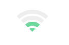

# Wifi Signal

### Overview

`WifiSignal` is a simply ReactJS component that draw a nice and super minimal Wifi signal.

#### Usage

Import `index.js` in your project and use it wherever:

    import WifiSignal from "<your_path>/WifiSignal"    
    
    export default function MyView() {
        return (
            

               <WifiSignal level={2} colors={{signal: "#34DC96"}}/>
            

        );
    }
    
##### Render    
    
 

#### Props

`WifiSignal` supports these props:

- **level:** the wifi power signal [0..4]
- **size:** the wifi div container size
- **top:** top margin of wifi, if necessary to move element
- **colors:** options fot set signal/no-signal "bars" colors

### Future releases

- [ ] provide method to animate bars in order to simulate signal searching
- [x] provide a better props documentation
- [x] let user customize other props such as no signal color